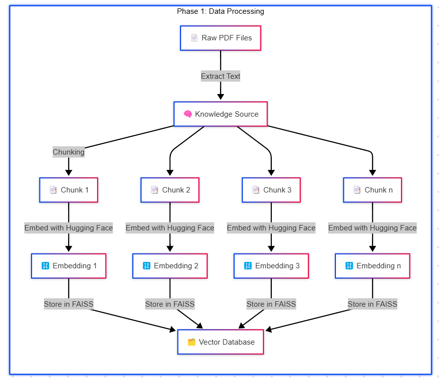
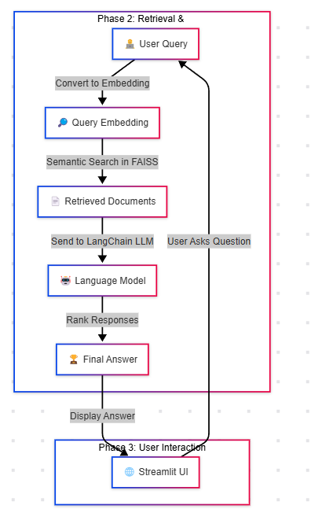

# MedInsight: Medical Knowledge Retrieval-Augmented Generation

## 📌 Overview
MedInsight is a **Retrieval-Augmented Generation (RAG) model** designed for medical applications. It combines **FAISS-based vector search** with **Mistral-7B** to provide accurate and context-aware responses to medical queries.


## 🚀 Features
- **🔍 Efficient Medical Knowledge Retrieval**: Uses FAISS for fast similarity search.
- **🤖 Powerful LLM (Mistral-7B)**: Provides high-quality medical insights.
- **📚 Context-Aware Responses**: Ensures factual accuracy by retrieving from a curated medical knowledge base.
- **🔄 Real-Time Interaction**: Seamless chatbot experience via Streamlit UI.

## ⚙️ Architecture
1. **FAISS Vector Store**: Stores and retrieves medical documents efficiently.
2. **Hugging Face Embeddings**: Uses `sentence-transformers/all-MiniLM-L6-v2` for vectorization.
3. **Mistral-7B Model**: Generates context-aware responses.
4. **Custom Prompt Engineering**: Ensures reliable and structured responses.





## 🎯 Use Cases
- **Medical Q&A Chatbot** 🏥
- **Clinical Decision Support** 💊
- **Healthcare Research Assistance** 📑
- **Medical Documentation Summarization** 🩺

## 🔧 Setup & Usage
1. Clone the repository:
   ```bash
   git clone https://github.com/namanomar/MedInsight.git
   cd MediRAG
   ```
2. Install dependencies:
   ```bash
   pip install -r requirements.txt
   ```
3. Set up environment variables:
   ```bash
   export HUGGING_FACE_TOKEN=your_token_here
   ```
   or make .env file and add
   ```bash
   HUGGING_FACE_TOKEN=your_token_here
   ```

4. Run the Streamlit chatbot:
   ```bash
   streamlit run app.py
   ```

## 📌 Future Improvements
- ✅ Expand medical knowledge base 📖
- ✅ Improve model fine-tuning for medical NLP 🧠
- ✅ Optimize inference speed 🚀

